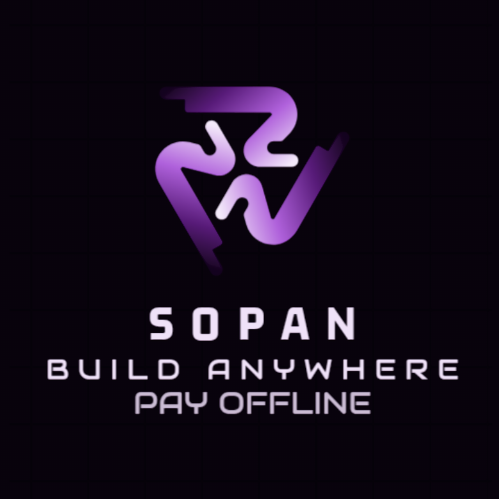

# 🌉 SOPAN WALLET
> **Bridging the Divide: Build Anywhere. Pay Offline**

<p align="center">
  
</p>

<p align="center">
  <a href="https://stellar.org"></a>
  <a href="https://soroban.stellar.org"></a>
  <a href="https://reactnative.dev"></a>
  <a href="LICENSE"></a>
</p>

<p align="center">
  <strong>The world's first mobile wallet combining offline-first payments with AI-powered smart contract migration.</strong>
</p>

---

## � Quick Links

<p align="center">
  <a href="https://expo.dev/accounts/ani11/projects/Sopan/builds/13c8411a-da42-4ac8-a2e7-eecded26aaaa">
    
  </a>
</p>

<p align="center">
  <a href="https://futurenet.stellarchain.io/contract/CBV5C5JWPKNZKR6TZN7K65P7WRN2OCRUUT7ZCGL5O4A3YBXU4SKS3524">
    
  </a>
  &nbsp;&nbsp;
  <a href="https://sopan-wallet-production.up.railway.app">
    
  </a>
</p>

---

## �📖 What is Sopan?

**Sopan Wallet** is a revolutionary dual-purpose crypto platform that solves two critical problems in blockchain adoption:

### 🌍 Problem 1: Connectivity Barriers
Billions of people live in areas with unreliable internet. Traditional crypto wallets become useless the moment you lose signal, leaving entire communities excluded from the digital economy.

### 🔧 Problem 2: Developer Migration Friction  
The blockchain ecosystem is fragmented. Developers who've built on Ethereum (Solidity) face months of work to migrate their dApps to high-performance networks like Stellar.

### ✨ Sopan's Solution
A unified platform that enables **offline payments for users** and **instant smart contract migration for developers**.

---

## 🚀 Dual-Engine Architecture

Sopan is powered by two groundbreaking engines working in tandem:

### 1️⃣ SOPAN CORE (Offline Payments Engine)
**The lifeline for unconnected economies.**

#### How It Works:
```
📱 User A (Offline) ──Bluetooth──> 📱 User B (Offline)
         │                                    │
         │ (Signs Transaction)                │ (Verifies Signature)
         │                                    │
         ▼                                    ▼
    [Local Queue]                        [Local Queue]
         │                                    │
         └──────── Internet Restored ─────────┘
                          │
                          ▼
                  🌐 Stellar Blockchain
                  (Final Settlement)
```

#### Key Features:
-   **📡 True Offline Mode**: Send XLM via Bluetooth Low Energy (BLE) when cellular networks fail
-   **🔐 Cryptographic Security**: Transactions are signed with Ed25519 keys, verified locally
-   **🔄 Intelligent Auto-Sync**: The `SyncService` queues signed transactions and auto-submits when online
-   **⚡ Near-Instant Finality**: Settles on Stellar in 3-5 seconds once broadcasted
-   **🛡️ Conflict Resolution**: Handles sequence number mismatches and balance conflicts automatically

#### Real-World Use Cases:
- 🏔️ **Remote Villages**: Farmers transact without cell towers
- 🚇 **Underground Transit**: Commuters pay for tickets in subway tunnels
- 🌊 **Maritime Commerce**: Fishermen settle payments at sea
- 🏚️ **Disaster Zones**: Emergency aid distribution during network outages

---

### 2️⃣ SOLUST AI (Smart Contract Bridge)
**A powerful AI assistant designed to migrate the world's dApps to Stellar.**

#### How It Works:
```
📄 Solidity Contract (.sol)
         │
         ▼
   🤖 Groq AI Analysis
   (Function Extraction)
         │
         ▼
   🧠 Intelligent Transpilation
   (Solidity → Rust/Soroban)
         │
         ▼
   📦 WASM Compilation
         │
         ▼
   🚀 One-Click Deployment
   (Testnet/Mainnet)
         │
         ▼
   ✅ Contract ID Generated
```

#### Key Features:
-   **🧠 AI-Powered Analysis**: Upload any Solidity contract; Groq AI extracts functions and logic
-   **🔄 Intelligent Conversion**: Automatically transpiles to optimized Stellar Rust (Soroban) code
-   **🛠️ Mobile Deployment**: Deploy contracts directly from your phone—no desktop IDE needed
-   **📱 Developer-Friendly**: Select specific functions to convert; preview before deployment
-   **🌉 Ecosystem Bridge**: Lowers the barrier for Ethereum developers to enter Stellar

#### Supported Patterns:
- ✅ ERC-20 Token Standards → Stellar Assets
- ✅ Payment Splitters → Multi-Operation Transactions
- ✅ Escrow Contracts → Time-Locked Payments
- ✅ DAO Voting → Weighted Signatures

---

## 💎 Why Sopan? (Unique Selling Propositions)

### For End Users 👥
| Traditional Wallets | Sopan Wallet |
|:---|:---|
| ❌ Requires constant internet | ✅ Works 100% offline via Bluetooth |
| ❌ Centralized mobile money (trust required) | ✅ Fully decentralized (you hold keys) |
| ❌ High fees (remittance services) | ✅ Fraction-of-a-cent fees (Stellar) |
| ❌ Vulnerable to SIM swapping | ✅ Cryptographically secured |

### For Developers 👨‍💻
| Manual Migration | Solust AI |
|:---|:---|
| ❌ Weeks of rewriting code | ✅ 5-second AI conversion |
| ❌ Requires Rust expertise | ✅ No Rust knowledge needed |
| ❌ Desktop IDE mandatory | ✅ Deploy from mobile device |
| ❌ Trial-and-error debugging | ✅ AI-optimized output |

---

## 🔗 Smart Contract Details

Sopan runs on custom Soroban logic for fee routing and treasury management.

-   **Contract ID**: `CBV5C5JWPKNZKR6TZN7K65P7WRN2OCRUUT7ZCGL5O4A3YBXU4SKS3524`
-   **Network**: Stellar Testnet
-   **Language**: Rust (Soroban SDK)
-   **Purpose**: Automatic 0.01% fee distribution to sustain the ecosystem

*This contract ensures that for every offline transaction synced, a micro-fee is transparently routed to the service treasury, creating a sustainable economic model.*

---

## 🛠️ Technology Stack

### Mobile Application
| Component | Technology |
|:---|:---|
| **Framework** | React Native (Expo SDK 54) |
| **Language** | TypeScript 5.3.0 |
| **Communication** | `react-native-ble-plx` (Bluetooth) |
| **Storage** | `expo-secure-store` (Keys), `AsyncStorage` (Metadata) |
| **UI/UX** | `expo-linear-gradient`, `react-native-reanimated` |
| **QR Codes** | `expo-camera`, `react-native-qrcode-svg` |
| **Biometrics** | `expo-local-authentication` |

### Blockchain Layer
| Component | Technology |
|:---|:---|
| **Network** | Stellar (Testnet/Mainnet) |
| **SDK** | `@stellar/stellar-sdk` 13.0.0 |
| **Smart Contracts** | Rust + Soroban SDK |
| **Cryptography** | `tweetnacl` (Ed25519), `@noble/hashes` |

### AI & Backend
| Component | Technology |
|:---|:---|
| **AI Model** | Groq (Llama 3.1 70B) |
| **Server** | Node.js / Express |
| **Containerization** | Docker |
| **Deployment** | Railway (Production) |
| **Live API** | [https://sopan-wallet-production.up.railway.app](https://sopan-wallet-production.up.railway.app) |

---

## 🎯 Feature Comparison

| Feature | Sopan | Traditional Wallets | Mobile Money Apps |
|:---|:---:|:---:|:---:|
| Offline Payments | ✅ | ❌ | ⚠️ (Centralized) |
| Decentralized | ✅ | ✅ | ❌ |
| Low Fees (<$0.01) | ✅ | ⚠️ (Varies) | ❌ |
| Smart Contract Support | ✅ | ⚠️ (Limited) | ❌ |
| AI Dev Tools | ✅ | ❌ | ❌ |
| Mobile Deployment | ✅ | ❌ | ❌ |
| Biometric Security | ✅ | ⚠️ (Some) | ⚠️ (Some) |

---

## 🔮 Future Roadmap

### Phase 1: Foundation (✅ Completed)
- [x] Offline BLE payments
- [x] Stellar integration
- [x] Solust AI transpilation
- [x] Mobile deployment

### Phase 2: Enhancement (🚧 In Progress)
- [ ] Mesh networking (multi-hop offline transactions)
- [ ] Hardware wallet support (Ledger/Trezor)
- [ ] Cross-border remittance anchors
- [ ] Advanced conflict resolution algorithms

### Phase 3: Ecosystem (📅 Planned)
- [ ] Merchant POS mode
- [ ] Multi-signature wallets
- [ ] Decentralized identity (DID) integration
- [ ] NFT support on Stellar

---

## 📦 Quick Start

### Prerequisites
- Node.js 18+
- Expo CLI
- Android Studio (for Android builds)

### Installation
```bash
# Clone the repository
git clone https://github.com/Anidipta/Sopan-Wallet.git
cd Sopan-Wallet/mobile

# Install dependencies
npm install

# Start development server
npx expo start

# Build for Android
eas build -p android --profile preview
```

### Environment Variables
Create a `.env` file in `/mobile`:
```env
GROQ_API_KEY=your_groq_api_key
SERVER_URL=https://sopan-wallet-production.up.railway.app
```

---

## 🤝 Contributing

We welcome contributions! Please see [CONTRIBUTING.md](./CONTRIBUTING.md) for guidelines.

### Development Workflow
1. Fork the repository
2. Create a feature branch (`git checkout -b feature/amazing-feature`)
3. Commit your changes (`git commit -m 'Add amazing feature'`)
4. Push to the branch (`git push origin feature/amazing-feature`)
5. Open a Pull Request

---

## 📄 License

This project is licensed under the MIT License - see the [LICENSE](LICENSE) file for details.

---

## 🌟 Acknowledgments

- **Stellar Development Foundation** for the robust blockchain infrastructure
- **Groq** for lightning-fast AI inference
- **Expo Team** for the incredible mobile development platform
- **Open Source Community** for the libraries that power this project

---

<p align="center">
  <strong>Empowering the Unconnected Economy</strong><br>
  Built with ❤️ by the Sopan Team
</p>

<p align="center">
  <a href="https://github.com/Anidipta/Sopan-Wallet">⭐ Star us on GitHub</a> •
  <a href="https://github.com/Anidipta/Sopan-Wallet/issues">🐛 Report Bug</a> •
  <a href="https://github.com/Anidipta/Sopan-Wallet/issues">💡 Request Feature</a>
</p>
