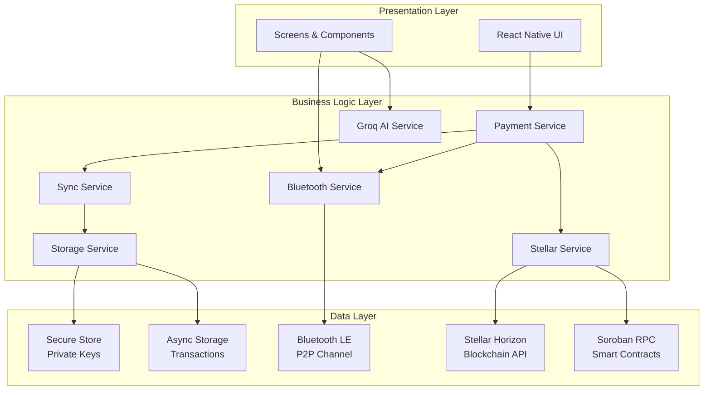
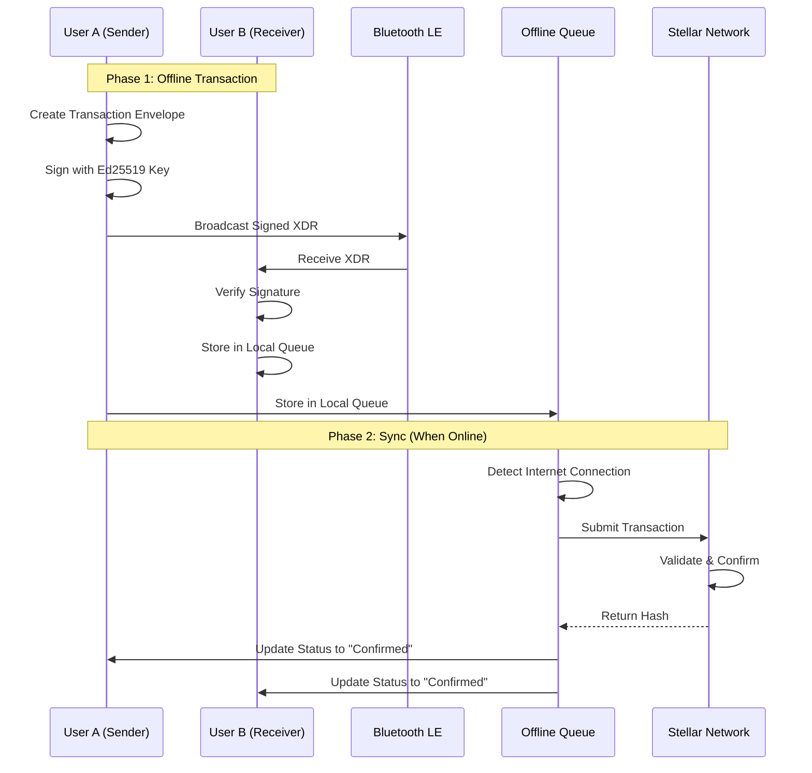
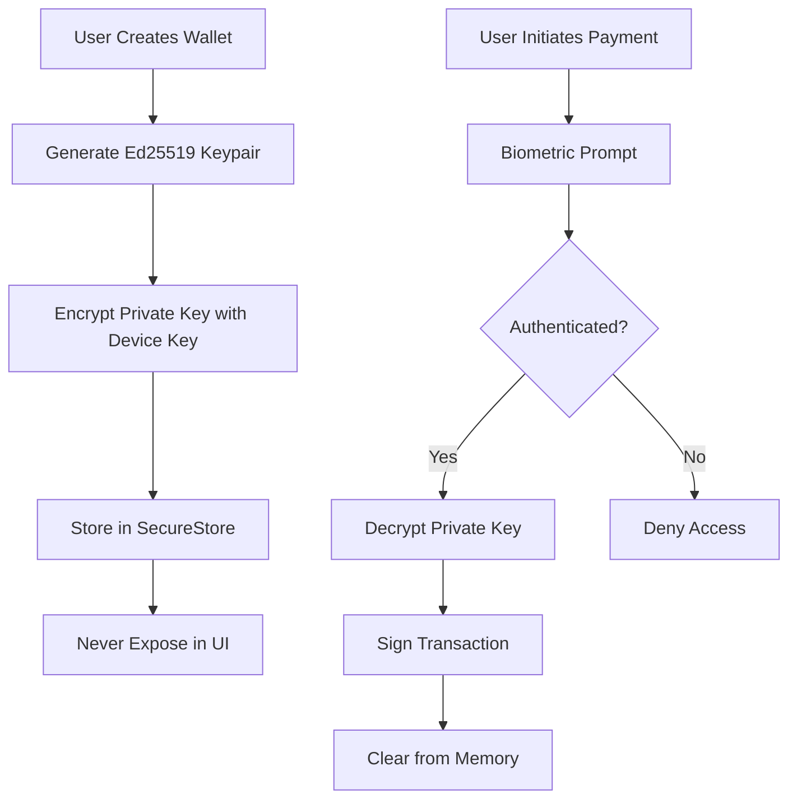
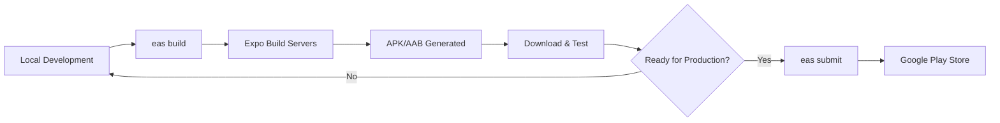
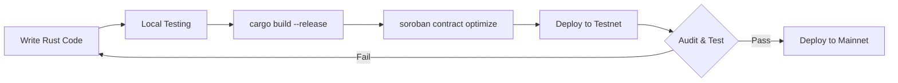

# 🏗️ Sopan Wallet - Technical Architecture Deep Dive

<p align="center">
  <strong>A comprehensive guide to the internal workings of Sopan's hybrid offline-online payment system</strong>
</p>

---

## 📋 Table of Contents
1. [System Overview](#-system-overview)
2. [Architecture Layers](#-architecture-layers)
3. [Offline-Online Sync Mechanism](#-offline-online-sync-mechanism)
4. [Smart Contract Workflow](#-smart-contract-workflow-rust--soroban)
5. [Security Architecture](#-security-architecture)
6. [Data Models](#-data-models)
7. [Service Layer](#-service-layer-detailed)
8. [Deployment Pipeline](#-deployment-pipeline)

---

## 🌐 System Overview

Sopan is built on a **three-tier architecture** that separates concerns while maintaining tight integration:



---

## 📂 Architecture Layers

### Layer 1: Presentation (UI/UX)
**Purpose**: User interaction and visual feedback

**Components**:
- **Screens**: Full-page views (`HomeScreen`, `SendScreen`, `SolustAIScreen`)
- **Components**: Reusable UI atoms (`Button`, `Card`, `QRView`)
- **Navigation**: State-based routing managed by `HomeScreen`

**Key Principles**:
- Functional components with React Hooks
- Unidirectional data flow
- Optimistic UI updates (show success before blockchain confirmation)

---

### Layer 2: Business Logic (Services)
**Purpose**: Core application logic and state management

**Services**:
1. **PaymentService**: Orchestrates payment flows (online/offline routing)
2. **BluetoothService**: Manages BLE connections and P2P transfers
3. **StellarService**: Wraps Stellar SDK for blockchain operations
4. **StorageService**: Handles all data persistence
5. **SyncService**: Background job for offline transaction reconciliation
6. **GroqService**: AI-powered Solidity-to-Rust conversion

**Design Pattern**: Singleton (ensures single instance per service)

---

### Layer 3: Data (Persistence & Communication)
**Purpose**: Storage and external communication

**Storage**:
- **SecureStore**: Encrypted private keys (iOS Keychain / Android Keystore)
- **AsyncStorage**: Transaction history, settings, offline queue

**Communication**:
- **Bluetooth LE**: Peer-to-peer offline transfers
- **Horizon API**: Stellar blockchain queries
- **Soroban RPC**: Smart contract invocations

---

## 🔄 Offline-Online Sync Mechanism (The Core Innovation)

### Problem Statement
Traditional crypto wallets are **binary**: they either work (online) or fail (offline). Sopan introduces a **gradient** where payments can occur in any connectivity state.

### Solution: Optimistic Offline Settlement



---

### Detailed Workflow

#### 1️⃣ Offline Phase (Bluetooth P2P)

**Step 1: Discovery**
```typescript
// BluetoothService.ts
async scanForSopanDevices(timeout: number): Promise<Device[]> {
  // Scan for devices advertising Sopan UUID
  const devices = await this.manager.startDeviceScan(
    [SOPAN_SERVICE_UUID],
    { allowDuplicates: false },
    (error, device) => {
      if (device) discoveredDevices.push(device);
    }
  );
  return devices;
}
```

**Step 2: Handshake**
- Central (Sender) connects to Peripheral (Receiver)
- Receiver shares `PublicKey` via Read Characteristic
- Sender verifies receiver is a valid Stellar address

**Step 3: Transaction Signing**
```typescript
// PaymentService.ts
const transaction = new StellarSdk.TransactionBuilder(sourceAccount, {
  fee: StellarSdk.BASE_FEE,
  networkPassphrase: StellarSdk.Networks.TESTNET
})
  .addOperation(StellarSdk.Operation.payment({
    destination: recipientPublicKey,
    asset: StellarSdk.Asset.native(),
    amount: amount.toString()
  }))
  .setTimeout(30)
  .build();

transaction.sign(sourceKeypair);
const xdr = transaction.toXDR(); // Base64 encoded envelope
```

**Step 4: Transfer**
- XDR string is written to Receiver's BLE Write Characteristic
- Receiver decodes and verifies signature matches sender's public key

**Step 5: Persistence**
```typescript
// StorageService.ts
await AsyncStorage.setItem('offline_transactions', JSON.stringify([
  {
    id: uuid(),
    xdr: signedXDR,
    sender: senderPublicKey,
    recipient: recipientPublicKey,
    amount: amount,
    timestamp: Date.now(),
    status: 'pending'
  }
]));
```

---

#### 2️⃣ Synchronization Phase (Auto-Sync)

**Trigger**: `NetInfo` detects internet connection

**Step 1: Queue Processing**
```typescript
// SyncService.ts
async syncOfflineTransactions(): Promise<number> {
  const offlineTxs = await this.storage.getOfflineTransactions();
  let synced = 0;
  
  for (const tx of offlineTxs) {
    try {
      // Reconstruct transaction from XDR
      const transaction = StellarSdk.TransactionBuilder.fromXDR(
        tx.xdr,
        StellarSdk.Networks.TESTNET
      );
      
      // Submit to Stellar
      const result = await this.stellar.server.submitTransaction(transaction);
      
      // Update status
      await this.storage.updateTransactionStatus(tx.id, 'confirmed', result.hash);
      synced++;
    } catch (error) {
      await this.handleSyncError(tx, error);
    }
  }
  
  return synced;
}
```

**Step 2: Conflict Resolution**

| Conflict Type | Detection | Resolution |
|:---|:---|:---|
| **Sequence Number Mismatch** | `tx_bad_seq` error | Auto-bump sequence & re-sign |
| **Insufficient Balance** | `op_underfunded` error | Notify user; mark as failed |
| **Duplicate Transaction** | `tx_duplicate` error | Check ledger; mark as confirmed if found |
| **Network Timeout (504)** | Timeout error with `extras.hash` | Verify hash on ledger before retry |

**Step 3: Confirmation**
- Once confirmed, local status updates to `completed`
- User receives push notification
- Transaction appears in history with blockchain hash

---

## 🦀 Smart Contract Workflow (Rust & Soroban)

### Development Pipeline


---

### 1️⃣ Development (Rust)

**Location**: `/smart_contract/contracts/payment-program/src/lib.rs`

**Example Contract**:
```rust
#![no_std]
use soroban_sdk::{contract, contractimpl, Address, Env};

#[contract]
pub struct PaymentContract;

#[contractimpl]
impl PaymentContract {
    /// Transfers tokens with automatic fee deduction
    pub fn pay(
        env: Env,
        from: Address,
        to: Address,
        token: Address,
        amount: i128
    ) -> Result<(), Error> {
        // Require authorization from sender
        from.require_auth();
        
        // Calculate fee (0.01%)
        let fee = amount / 10000;
        let net_amount = amount - fee;
        
        // Transfer to recipient
        token::Client::new(&env, &token)
            .transfer(&from, &to, &net_amount);
        
        // Transfer fee to treasury
        token::Client::new(&env, &token)
            .transfer(&from, &TREASURY_ADDRESS, &fee);
        
        Ok(())
    }
}
```

---

### 2️⃣ Compilation (WASM)

**Command**:
```bash
cd smart_contract/contracts/payment-program
cargo build --target wasm32-unknown-unknown --release
```

**Output**: `target/wasm32-unknown-unknown/release/payment_program.wasm`

**Optimization**:
```bash
soroban contract optimize --wasm payment_program.wasm
```
*Reduces binary size from ~200KB to <100KB*

---

### 3️⃣ Deployment

**Step 1: Install WASM**
```bash
soroban contract install \
  --wasm target/wasm32-unknown-unknown/release/payment_program.wasm \
  --network testnet
```
**Output**: `WASM Hash: a1b2c3d4...`

**Step 2: Deploy Contract**
```bash
soroban contract deploy \
  --wasm-hash a1b2c3d4... \
  --network testnet \
  --source WALLET_SECRET_KEY
```
**Output**: `Contract ID: CBV5C5JWPKNZKR6TZN7K65P7WRN2OCRUUT7ZCGL5O4A3YBXU4SKS3524`

**Step 3: Mobile Integration**
```typescript
// src/config/token.ts
export const PAYMENT_CONTRACT_ID = 'CBV5C5JWPKNZKR6TZN7K65P7WRN2OCRUUT7ZCGL5O4A3YBXU4SKS3524';

// src/services/StellarService.ts
const contract = new StellarSdk.Contract(PAYMENT_CONTRACT_ID);
const operation = contract.call(
  'pay',
  new StellarSdk.Address(sender).toScVal(),
  new StellarSdk.Address(recipient).toScVal(),
  new StellarSdk.Address(tokenAddress).toScVal(),
  new StellarSdk.ScInt(amount).toI128()
);
```

---

## 🔒 Security Architecture

### Threat Model

| Threat | Mitigation |
|:---|:---|
| **Private Key Theft** | Encrypted storage (Keystore/Keychain) + Biometric gate |
| **Man-in-the-Middle (BLE)** | Signature verification; no sensitive data in plaintext |
| **Replay Attacks** | Sequence numbers + unique nonces |
| **Phishing** | Address validation; QR code verification |
| **Malicious Peers** | Cryptographic signature validation |

---

### Key Management



**Implementation**:
```typescript
// StorageService.ts
async saveWallet(publicKey: string, secretKey: string): Promise<void> {
  // Store public key in AsyncStorage (safe to expose)
  await AsyncStorage.setItem('wallet_public_key', publicKey);
  
  // Encrypt and store private key in SecureStore
  await SecureStore.setItemAsync('wallet_secret_key', secretKey, {
    keychainAccessible: SecureStore.WHEN_UNLOCKED_THIS_DEVICE_ONLY
  });
}
```

---

### Biometric Protection

**Trigger Points**:
1. Viewing private key
2. Signing transactions (online or offline)
3. Modifying trustlines
4. Deploying smart contracts

**Implementation**:
```typescript
// BiometricService.ts
async authenticateForPayment(amount: number): Promise<boolean> {
  const result = await LocalAuthentication.authenticateAsync({
    promptMessage: `Confirm payment of ${amount} XLM`,
    fallbackLabel: 'Use Passcode',
    disableDeviceFallback: false
  });
  
  return result.success;
}
```

---

## 📊 Data Models

### OfflineTransaction
```typescript
interface OfflineTransaction {
  id: string;                    // UUID v4
  xdr: string;                   // Signed Stellar Envelope (base64)
  sender: string;                // Public Key (G...)
  recipient: string;             // Public Key (G...)
  amount: string;                // "10.5" (string to avoid float precision)
  asset?: {                      // Optional custom asset
    code: string;
    issuer: string;
  };
  timestamp: number;             // UTC milliseconds
  status: 'pending' | 'synced' | 'failed';
  retryCount: number;            // For exponential backoff
  lastAttempt?: number;          // Last sync attempt timestamp
  blockchainHash?: string;       // Stellar transaction hash (once confirmed)
  error?: string;                // Error message if failed
}
```

### Wallet
```typescript
interface Wallet {
  publicKey: string;             // Stellar public key (G...)
  encryptedPrivateKey: string;   // AES-256 encrypted secret key
  balance: number;               // XLM balance (cached)
  assets: Asset[];               // Custom tokens
  createdAt: number;             // Wallet creation timestamp
}
```

### SorobanDeployment
```typescript
interface SorobanDeployment {
  id: string;                    // Deployment ID
  network: 'testnet' | 'mainnet';
  rustCode: string;              // Source Rust code
  wasmHash?: string;             // WASM hash from installation
  contractId?: string;           // Deployed contract address
  deployer: string;              // Public key of deployer
  status: 'pending' | 'deploying' | 'completed' | 'failed';
  timestamp: number;
}
```

---

## 🔧 Service Layer (Detailed)

### PaymentService
**Responsibility**: Orchestrate payment flows

**Key Methods**:
```typescript
class PaymentService {
  async sendPayment(
    recipient: string,
    amount: number,
    secretKey: string,
    options?: { forceOnline?: boolean }
  ): Promise<{ success: boolean; txId?: string; error?: string }> {
    // 1. Check forceOnline flag
    if (options?.forceOnline) {
      return this.sendOnlinePayment(recipient, amount, secretKey);
    }
    
    // 2. Attempt offline handshake
    const offlineResult = await this.sendOfflinePayment(recipient, amount, secretKey);
    
    // 3. If offline succeeded and we're offline, return early
    if (offlineResult.success && !await this.isOnline()) {
      return offlineResult;
    }
    
    // 4. Otherwise, sync to blockchain
    return this.sendOnlinePayment(recipient, amount, secretKey);
  }
}
```

---

### BluetoothService
**Responsibility**: Manage BLE connections

**State Machine**:
```
[Idle] --scan--> [Scanning] --found--> [Connecting]
                                            |
                                            v
                                      [Connected]
                                            |
                                    transfer--> [Transferring]
                                            |
                                            v
                                      [Completed]
```

---

### StellarService
**Responsibility**: Blockchain operations

**Key Methods**:
```typescript
class StellarService {
  // Standard payment
  async sendTransaction(
    secretKey: string,
    recipient: string,
    amount: number,
    asset?: Asset
  ): Promise<string>;
  
  // Payment with fee deduction (via smart contract)
  async sendPaymentWithFee(
    secretKey: string,
    recipient: string,
    amount: number
  ): Promise<string>;
  
  // Verify transaction on ledger
  async confirmTransaction(hash: string): Promise<boolean>;
}
```

---

## 🚀 Deployment Pipeline

### Mobile App (React Native)



**Commands**:
```bash
# Development build
eas build -p android --profile preview

# Production build
eas build -p android --profile production

# Over-the-air updates (JS only)
eas update --branch production
```

---

### Smart Contracts (Rust/Soroban)



**CI/CD (Future)**:
```yaml
# .github/workflows/deploy-contract.yml
name: Deploy Soroban Contract
on:
  push:
    branches: [main]
    paths: ['smart_contract/**']

jobs:
  deploy:
    runs-on: ubuntu-latest
    steps:
      - uses: actions/checkout@v3
      - name: Install Soroban CLI
        run: cargo install soroban-cli
      - name: Build Contract
        run: cargo build --release
      - name: Deploy to Testnet
        run: soroban contract deploy --network testnet
```

---

## 📈 Performance Considerations

### Offline Transaction Limits
- **Max Queue Size**: 100 transactions (prevents storage bloat)
- **Max Retry Attempts**: 3 per transaction (exponential backoff)
- **Sync Interval**: 30 seconds (when online)

### Blockchain Optimization
- **Batch Submission**: Group multiple offline txs into single ledger (future)
- **Fee Bumping**: Auto-adjust fees during network congestion
- **Sequence Management**: Pre-fetch next 10 sequence numbers

---

## 🎯 Design Principles

1. **Offline First**: Assume no connectivity; sync is a bonus
2. **Fail Gracefully**: Never lose user data; queue and retry
3. **Transparent Security**: Users see exactly what they're signing
4. **Developer Friendly**: Clear APIs; extensive logging
5. **Modular Architecture**: Services are independent; easy to test

---

<p align="center">
  <strong>This architecture enables a resilient, secure, and developer-friendly payment platform.</strong><br>
  Built for the real world. Powered by Stellar.
</p>
